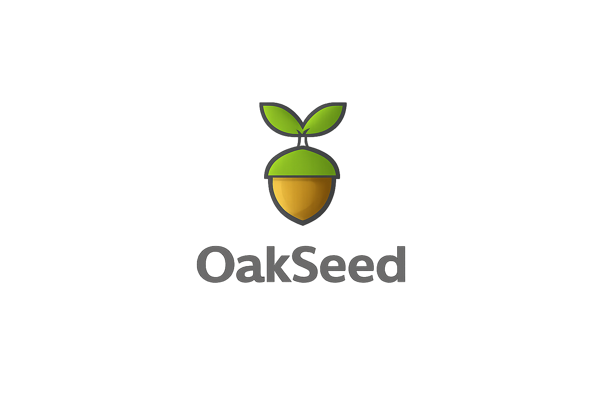

# Deno Boot Engine (OSE)



> **⚠️ Status: Early Development / Unstable**
>
> Deno Boot Engine is **actively under development**. APIs, behavior, naming, and internal architecture may change **frequently and without notice**. Do **not** rely on Deno Boot Engine for production use at this stage.

---

## Overview

**Deno Boot Engine (OSE)** is an experimental, modular **plugin engine built on top of Deno and Oak**, designed to provide a clean, extensible foundation for building multi-tenant, plugin-driven web applications.

The core idea behind Deno Boot is simple:

> 🌱 *Plant a small, composable seed — let functionality grow through plugins.*

OSE aims to make it easy to:

* Load and isolate plugins
* Share common infrastructure (routing, events, services)
* Support multi-tenant applications
* Evolve systems incrementally without tight coupling

This project is part of ongoing exploration into **runtime composition**, **developer ergonomics**, and **long-lived backend architectures**.

---

## Goals

Deno Boot Engine is being built with the following goals in mind:

* **Plugin-first architecture**
* **Deno-native** (no Node.js compatibility layer)
* **Oak-based HTTP lifecycle**
* **Strong isolation boundaries** between plugins
* **Explicit dependency wiring** (no magic globals)
* **Support for multi-tenancy** from day one
* **Readable, hackable codebase** over abstraction-heavy frameworks

---

## Non-Goals (For Now)

To keep scope realistic, Deno Boot Engine intentionally does **not** aim to be:

* A full framework replacement (e.g. Next.js, NestJS)
* Stable or production-ready (yet)
* Backwards compatible between versions
* Opinionated about databases, ORMs, or UI layers

---

## Architecture (High-Level)

While the internals are evolving, Deno Boot Engine roughly consists of:

* **Core Engine**

  * Plugin lifecycle management
  * Shared service container
  * Event bus / hooks

* **Plugin System**

  * Explicit registration
  * Scoped access to engine capabilities
  * Optional tenant awareness

* **Tenant Layer**

  * Tenant-aware routing
  * Tenant-scoped services and state

* **Oak Integration**

  * HTTP server and middleware
  * Route mounting from plugins

Expect this structure to shift as the engine matures.

---

## Example (Conceptual)

```ts
import { definePlugin } from "@denoboot/engine";

export default definePlugin({
  name: "example-plugin",

  setup({ router, events }) {
    router.get("/hello", (ctx) => {
      ctx.response.body = "Hello from Deno Boot";
    });

    events.on("engine:ready", () => {
      console.log("Plugin initialized");
    });
  }
});
```

> ⚠️ This example is illustrative only. Actual APIs may differ.

---

## Development Status

* 🚧 APIs are **unstable**
* 🚧 Documentation is **incomplete**
* 🚧 Breaking changes are **expected**
* 🚧 Internal refactors happen often

If you are using Deno Boot Engine right now, you are an **early explorer**, not an end user.

---

## Who Is This For?

Deno Boot Engine is currently best suited for:

* Developers experimenting with **plugin architectures**
* Learning projects around **Deno + Oak**
* Prototyping multi-tenant backend systems
* Contributors interested in shaping the engine

If you need stability, maturity, or long-term guarantees — this project is **not there yet**.

---

## Contributing

Contributions, ideas, and discussions are welcome — especially around:

* Plugin lifecycle design
* Tenant isolation strategies
* DX improvements
* Clearer mental models and naming

That said, expect:

* Minimal guardrails
* Rapid iteration
* Breaking changes without deprecation cycles

Open issues or discussions before submitting large PRs.

---

## License

License to be defined.

---

## Final Note

Deno Boot Engine is an experiment.

If it grows into something solid — great.
If it teaches useful lessons — even better.

🌱
